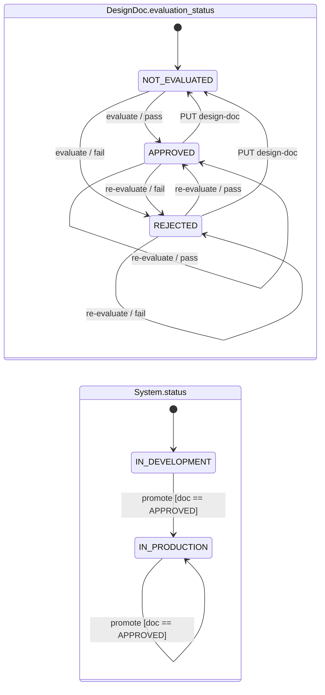

# AI Backend Interview

## Overview

Minimal FastAPI backend implementing a small MVP: managing **GEICO systems**
and their **design docs**. A system starts in development, its design doc is
evaluated by a (stubbed) LLM bot, and the system can only be promoted to
production once the doc is approved.

Storage is an in-memory dictionary and the entire implementation lives in
`app/main.py` — no database or extra architecture layers.

## Domain

- **System** — `id`, `name`, `status` (`IN-DEVELOPMENT` | `IN-PRODUCTION`),
  and a `design_doc`.
- **DesignDoc** — `content`, `evaluation_status`
  (`NOT-EVALUATED` | `APPROVED` | `REJECTED`), and `evaluation_feedback`.

**Rules**

- A new system starts `IN-DEVELOPMENT` with a `NOT-EVALUATED` doc.
- Evaluation is a deterministic stub standing in for an LLM bot: a doc with
  enough substance (≥ 50 characters) is `APPROVED`, otherwise `REJECTED`.
- Editing the design doc resets its evaluation back to `NOT-EVALUATED`.
- A system can be promoted to `IN-PRODUCTION` **only** when its doc is
  `APPROVED`; otherwise promotion returns `409`.

## State Machine

Two orthogonal machines — the doc's evaluation status, and the system's status
gated on it.



| System status | Doc state | Event | Result | HTTP |
| --- | --- | --- | --- | --- |
| any | any | `PUT /design-doc` | doc → `NOT-EVALUATED`, feedback cleared | 200 |
| any | any | `POST /evaluate` | verdict recomputed → `APPROVED` \| `REJECTED` | 200 |
| `IN-DEVELOPMENT` | `APPROVED` | `POST /promote` | → `IN-PRODUCTION` | 200 |
| `IN-DEVELOPMENT` | ≠ `APPROVED` | `POST /promote` | no change | 409 |
| `IN-PRODUCTION` | `APPROVED` | `POST /promote` | no change (idempotent) | 200 |
| `IN-PRODUCTION` | ≠ `APPROVED` | `POST /promote` | no change | 409 |
| any | any | any, unknown id | — | 404 |
| — | — | invalid body | — | 422 |

`evaluate` is unguarded — accepted from any doc state and any system status,
recomputing the verdict each time. `promote` reads only the doc and never
checks `System.status`.

**Invariant:** `status == IN-PRODUCTION` ⇒ `evaluation_status == APPROVED` *at
the moment of promotion* — see Current Limitations.

## API

| Method | Path                                     | Description                                  |
| ------ | ---------------------------------------- | -------------------------------------------- |
| GET    | `/health`                                | Health check → `{"status": "ok"}`            |
| POST   | `/systems`                               | Create a system with a design doc (`201`)    |
| GET    | `/systems/{system_id}`                   | Retrieve a system (`404` if unknown)         |
| PUT    | `/systems/{system_id}/design-doc`        | Replace doc content; resets evaluation (`404` if unknown) |
| POST   | `/systems/{system_id}/design-doc/evaluate` | Evaluate the doc → `APPROVED` / `REJECTED` |
| POST   | `/systems/{system_id}/promote`           | Promote to production (`409` if not approved)|

### Example

```bash
# Create a system and capture its id
SID=$(curl -s -X POST http://127.0.0.1:8000/systems \
  -H 'Content-Type: application/json' \
  -d '{"name":"Billing","design_doc_content":"This system stores and serves customer policy data with enough detail to pass evaluation."}' \
  | python3 -c 'import sys,json;print(json.load(sys.stdin)["id"])')

curl -s http://127.0.0.1:8000/systems/$SID                              # retrieve
curl -s -X POST http://127.0.0.1:8000/systems/$SID/design-doc/evaluate  # evaluate -> APPROVED
curl -s -X POST http://127.0.0.1:8000/systems/$SID/promote              # promote -> IN-PRODUCTION
```

## Project Structure

```
app/
  main.py             MVP implementation: models, enums, in-memory store, endpoints
  api/
    routes.py         /health route
  models/
    schemas.py        Pydantic schemas (scaffolding, unused by the MVP)
  services/           Empty scaffolding
  repositories/       Empty scaffolding
tests/
  test_health.py      Test for the /health endpoint
  test_systems.py     Create/evaluate/promote flow, plus characterization
                      tests pinning known limitations (see below)
docs/
  prompts/            The prompts that produced the code — treated as the spec
  notes/              Session record and design reasoning (00–03)
CLAUDE.md             Working context for AI-assisted sessions
requirements.txt
pyproject.toml        Ruff and pytest configuration
.env.example
```

## Environment Setup

Requires Python 3.12.

```bash
python3.12 -m venv .venv
source .venv/bin/activate
pip install -r requirements.txt
cp .env.example .env
```

## Running the API

```bash
fastapi dev app/main.py
```

The API is available at `http://127.0.0.1:8000`. Interactive docs are at
`http://127.0.0.1:8000/docs`.

## Running Tests

```bash
pytest
```

## Running Linting

```bash
ruff check .
ruff format .
```

## Documentation

This was built as a time-boxed, AI-assisted exercise. The prompts that produced
the implementation are checked in, along with the session record and the design
reasoning that followed from it:

| Document | Contents |
| --- | --- |
| `docs/prompts/01-project-scaffolding.md` | Pre-built scaffold (venv, FastAPI, ruff, `/health`) |
| `docs/prompts/02a-mvp-core.md` | Core MVP: create / retrieve / evaluate / promote + guard |
| `docs/prompts/02b-doc-update.md` | Follow-on: doc update path + evaluation reset |
| `docs/notes/00-geico-ai-coding-interview-07212026.md` | Session notes — requirements Q&A, state machine, named tradeoffs |
| `docs/notes/01-post-interview-hardening-plan.md` | The follow-up conformance pass, and why each hole was closed or deferred |
| `docs/notes/02-llm-evaluator-design-brief.md` | How the stubbed evaluator would be designed for real — authority model, failure modes, build order |
| `docs/notes/03-design-doc-lifecycle.md` | Why approvals bind to immutable revisions, and why doc drift is measured rather than gated |

`CLAUDE.md` at the repo root carries the working context for AI-assisted
sessions — commands, scope constraints, conventions, and the behaviors that
must not be "fixed" without reading the reasoning first. The prompts are the
specification: where the code and a prompt disagree, the code drifted.

## Current Limitations

Deliberate MVP tradeoffs, not oversights:

- **In-memory storage only** — data is lost on restart, and system ids are
  valid only for the life of the process. A real governance platform needs
  durable storage plus an immutable audit trail of who approved what, when,
  and why.
- **Evaluation is a length-based stub**, not a real LLM call. It sits behind
  the `evaluate_design_doc()` seam so an LLM or policy engine can be swapped in
  without changing the API contract. Productionizing it would need prompt/
  version pinning for reproducible verdicts, stored rationale, human override,
  and prompt-injection defense — the doc is user-supplied text an LLM reads.
- **No authn/authz** — in particular no separation of duties between the
  author, the evaluator, and whoever promotes.
- **No operation except `promote` reads `System.status`**, so the doc lifecycle
  runs independently of whether the system is live. Three consequences, all
  pinned by characterization tests and all fixed the same way — doc versioning
  with the approved revision pinned to the release, rather than guards on each
  edit (reasoning in `docs/notes/03-design-doc-lifecycle.md`):
  - Editing a promoted system's doc is not blocked, so an `IN-PRODUCTION`
    system can end up with a `NOT-EVALUATED` doc
    (`test_editing_doc_after_promotion_leaves_stale_production_system`).
  - `IN-PRODUCTION` + `REJECTED` is reachable by editing then re-evaluating
    (`test_in_production_system_can_reach_rejected_doc`).
  - `evaluate` is unguarded and recomputes the verdict from any state. Benign
    with a deterministic stub; with a sampled LLM verdict this is the
    retry-until-approved path.
- **Double-promote is idempotent only while the doc stays `APPROVED`** — `200`
  in that case (`test_promote_is_idempotent_when_already_in_production`), but
  `409` once the doc is no longer approved, which reads as "cannot be promoted"
  about an already-promoted system
  (`test_promote_on_production_system_with_rejected_doc_returns_409`).
- No database, migrations, or Docker. `services/` and `repositories/` remain
  empty scaffolding.
