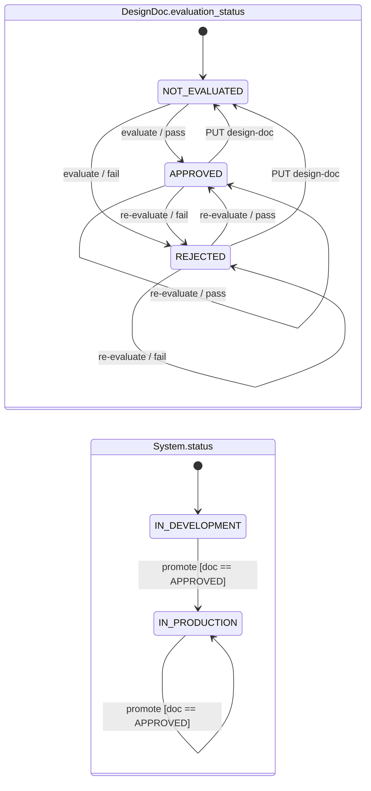

# GEICO AI Coding Interview — 2026-07-21

Session notes. The problem statement and the prompts I fed the LLM live in
`docs/prompts/02a-mvp-core.md` and `docs/prompts/02b-doc-update.md` — not
duplicated here.

**Format:** 1 hour total, ~40–45 min of that is the build. Interviewer: Steve,
builds GEICO's software-governance infrastructure (making sure required design
and security reviews happen before a system ships).

---

## Business rules (as given)

- A system is `IN-DEVELOPMENT` or `IN-PRODUCTION`.
- A system must have a design doc.
- The doc is evaluated by an LLM bot.
- A system may go to production **iff** the doc is approved.

---

## Clarifying questions asked (before any code)

| Question | Answer | Design consequence |
| --- | --- | --- |
| Doc required at creation, or only before production? | At creation | `design_doc` is required on `POST /systems` |
| Multiple doc versions per system? | Not needed for MVP | One current doc, embedded in `System` |
| Evaluation automatic or API-triggered? | API-triggered | Explicit `POST /evaluate` endpoint |
| After rejection, how does the doc get fixed? | *Raised by interviewer* — I'd missed it | Added `PUT /design-doc`, which resets evaluation |
| Minimum viable lifecycle? | create → evaluate → promote | Scoped out versioning, persistence, auth |

The fourth row is the one to remember: I did not have an update path in the
first pass. He prompted; I folded it in. Next time, walk the *unhappy* path
explicitly during clarification — every rejection state needs an exit.

---

## State machine

Two orthogonal machines. This is the whole exercise.

`evaluate` has **no guard** — it is accepted from any doc state and from any
system status, and simply recomputes the verdict. With the deterministic stub
the re-evaluate edges are self-loops in practice; with a sampled LLM verdict
`REJECTED → APPROVED` on unchanged content becomes reachable, which is the
retry-until-approved hole.

| System status | Doc state | Event | Guard | Result | HTTP |
| --- | --- | --- | --- | --- | --- |
| any | any | `PUT /design-doc` | — | doc → `NOT-EVALUATED`, feedback cleared | 200 |
| any | any | `POST /evaluate` | — | verdict recomputed → `APPROVED` \| `REJECTED` | 200 |
| `IN-DEVELOPMENT` | `APPROVED` | `POST /promote` | — | → `IN-PRODUCTION` | 200 |
| `IN-DEVELOPMENT` | ≠ `APPROVED` | `POST /promote` | — | no change | 409 |
| `IN-PRODUCTION` | `APPROVED` | `POST /promote` | — | no change (idempotent) | 200 |
| `IN-PRODUCTION` | ≠ `APPROVED` | `POST /promote` | — | no change | **409** |
| any | any | any, unknown id | — | — | 404 |
| — | — | invalid body | — | — | 422 |

**`promote` reads only the doc; it never checks `System.status`.** That is why
the last row exists: a system already in production gets "cannot be promoted"
if its doc has since been edited or re-evaluated to anything but `APPROVED`.

**Invariant:** `status == IN-PRODUCTION` ⇒ `evaluation_status == APPROVED` *at
the moment of promotion*. Not continuously — see below.

---

## Known holes, as deliberate choices

All of these live in the shipped code and are pinned by characterization tests
— see `01-post-interview-hardening-plan.md`. All share one root cause: **no
operation except `promote` ever reads `System.status`**, so the doc lifecycle
runs independently of whether the system is live.

1. **`PUT /design-doc` has no status guard.** Editing the doc on an
   already-promoted system leaves an `IN-PRODUCTION` system with a
   `NOT-EVALUATED` doc. Real fix: version the doc and pin the approved revision
   to the release, so edits create a new draft instead of invalidating prod.
2. **`IN-PRODUCTION` + `REJECTED` is reachable.** Promote, edit the doc, then
   re-evaluate: a live system whose design doc has been actively rejected.
   Strictly worse than hole 1 and reached the same way.
3. **`evaluate` is unguarded.** Allowed from any doc state and any system
   status, recomputing the verdict each time. Benign with a deterministic stub;
   with a sampled LLM verdict it is the retry-until-approved path.
4. **Double-promote is idempotent only while the doc stays `APPROVED`.** It
   returns 200 in that case — the right choice, since promote is a
   desired-state operation. But from hole 2 it returns 409, which reads as
   "cannot be promoted" about a system that is already in production.

## Deferred by design (name these before being asked)

- **Evaluator is a stub** — length heuristic behind `evaluate_design_doc()`.
  Deliberate: deterministic and testable. The seam swaps for a real LLM or
  policy engine with no API change.
- **Persistence + audit log** — in-memory is MVP-only. In a governance
  platform the immutable record of *who approved what, when, and why* is
  arguably the core requirement, not a follow-up.
- **Authz / separation of duties** — author ≠ evaluator ≠ promoter.
- **LLM productionization** — prompt/version pinning for reproducible verdicts,
  stored rationale, human override, and prompt-injection defense (the doc is
  user-supplied text that an LLM reads).

---

## Timing (actual, use as a template)

| T+ | Phase |
| --- | --- |
| 0–8 | Clarifying questions, whiteboard the lifecycle |
| 8–12 | Write the implementation prompt |
| 12–25 | Generate, then read the diff out loud — models, storage, guard, tests |
| 25–35 | `pytest`, then a live curl smoke test |
| 35–45 | Tradeoffs + deferred list |

Steve called it after the first successful smoke test — "a good stopping
point." Budget was ~40 min; ending early on a working demo was fine.

---

## Environment (verified pre-interview)

`python3.12 -m venv .venv` → `pip install -r requirements.txt` → `ruff check .`
→ `pytest -v` → `fastapi dev app/main.py`, `GET /health` returns
`{"status":"ok"}`. Scaffold committed ahead of time; only `app/main.py` and
`tests/` were written live.
