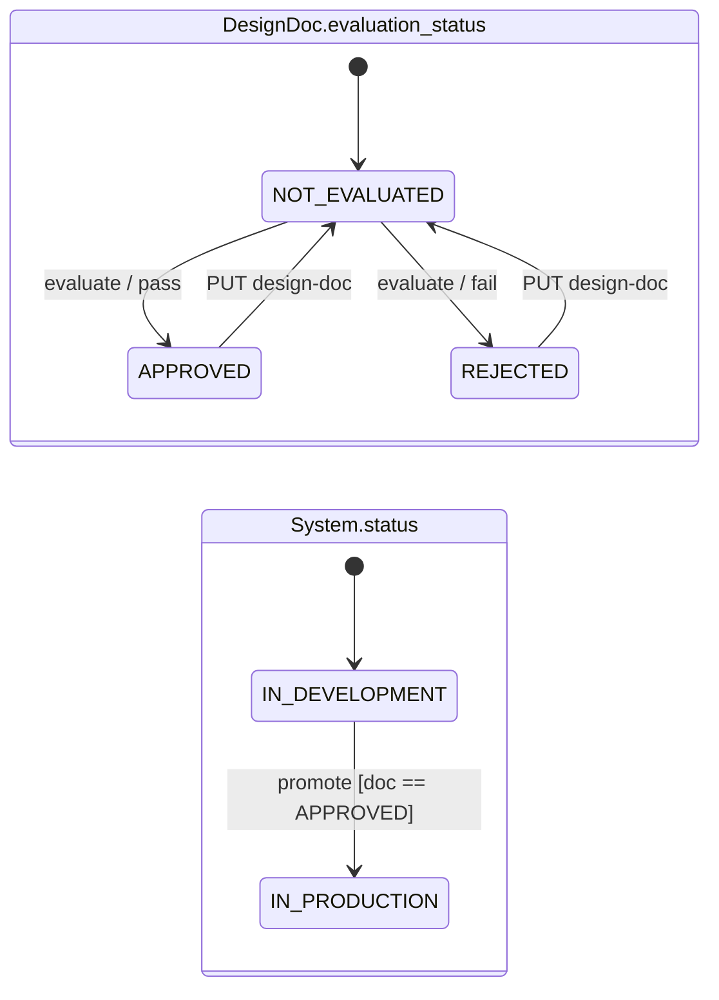

# GEICO AI Coding Interview — 2026-07-21

Session notes. The problem statement and the prompts I fed the LLM live in
`docs/prompts/02a-mvp-core.md` and `docs/prompts/02b-doc-update.md` — not
duplicated here.

**Format:** 1 hour total, ~40–45 min of that is the build. Interviewer: Steve,
builds GEICO's software-governance infrastructure (making sure required design
and security reviews happen before a system ships).

---

## Business rules (as given)

- A system is `IN-DEVELOPMENT` or `IN-PRODUCTION`.
- A system must have a design doc.
- The doc is evaluated by an LLM bot.
- A system may go to production **iff** the doc is approved.

---

## Clarifying questions asked (before any code)

| Question | Answer | Design consequence |
| --- | --- | --- |
| Doc required at creation, or only before production? | At creation | `design_doc` is required on `POST /systems` |
| Multiple doc versions per system? | Not needed for MVP | One current doc, embedded in `System` |
| Evaluation automatic or API-triggered? | API-triggered | Explicit `POST /evaluate` endpoint |
| After rejection, how does the doc get fixed? | *Raised by interviewer* — I'd missed it | Added `PUT /design-doc`, which resets evaluation |
| Minimum viable lifecycle? | create → evaluate → promote | Scoped out versioning, persistence, auth |

The fourth row is the one to remember: I did not have an update path in the
first pass. He prompted; I folded it in. Next time, walk the *unhappy* path
explicitly during clarification — every rejection state needs an exit.

---

## State machine

Two orthogonal machines. This is the whole exercise.

| From | Event | Guard | To | HTTP |
| --- | --- | --- | --- | --- |
| any doc state | `PUT /design-doc` | — | doc → `NOT-EVALUATED`, feedback cleared | 200 |
| any doc state | `POST /evaluate` | — | `APPROVED` \| `REJECTED` | 200 |
| `IN-DEVELOPMENT` | `POST /promote` | doc `APPROVED` | `IN-PRODUCTION` | 200 |
| `IN-DEVELOPMENT` | `POST /promote` | doc ≠ `APPROVED` | no change | 409 |
| `IN-PRODUCTION` | `POST /promote` | — | no change | 200 (idempotent) |
| — | any, unknown id | — | — | 404 |

**Invariant:** `status == IN-PRODUCTION` ⇒ `evaluation_status == APPROVED` *at
the moment of promotion*. Not continuously — see below.

---

## Known holes, as deliberate choices

Two live in the shipped code. Both are good things to say out loud rather than
be caught on. Both are now pinned by characterization tests — see
`post-interview-hardening-plan.md`.

1. **`PUT /design-doc` has no status guard.** Editing the doc on an
   already-promoted system leaves an `IN-PRODUCTION` system with a
   `NOT-EVALUATED` doc. Real fix: version the doc and pin the approved revision
   to the release, so edits create a new draft instead of invalidating prod.
2. **Double-promote returns an idempotent 200.** 200 vs. 409 is a real choice;
   idempotent is the right one, since promote is a desired-state operation.

## Deferred by design (name these before being asked)

- **Evaluator is a stub** — length heuristic behind `_evaluate_design_doc()`.
  Deliberate: deterministic and testable. The seam swaps for a real LLM or
  policy engine with no API change.
- **Persistence + audit log** — in-memory is MVP-only. In a governance
  platform the immutable record of *who approved what, when, and why* is
  arguably the core requirement, not a follow-up.
- **Authz / separation of duties** — author ≠ evaluator ≠ promoter.
- **LLM productionization** — prompt/version pinning for reproducible verdicts,
  stored rationale, human override, and prompt-injection defense (the doc is
  user-supplied text that an LLM reads).

---

## Timing (actual, use as a template)

| T+ | Phase |
| --- | --- |
| 0–8 | Clarifying questions, whiteboard the lifecycle |
| 8–12 | Write the implementation prompt |
| 12–25 | Generate, then read the diff out loud — models, storage, guard, tests |
| 25–35 | `pytest`, then a live curl smoke test |
| 35–45 | Tradeoffs + deferred list |

Steve called it after the first successful smoke test — "a good stopping
point." Budget was ~40 min; ending early on a working demo was fine.

---

## Environment (verified pre-interview)

`python3.12 -m venv .venv` → `pip install -r requirements.txt` → `ruff check .`
→ `pytest -v` → `fastapi dev app/main.py`, `GET /health` returns
`{"status":"ok"}`. Scaffold committed ahead of time; only `app/main.py` and
`tests/` were written live.
